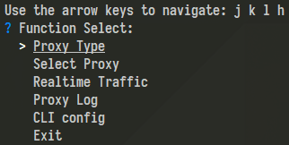
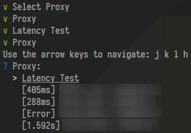
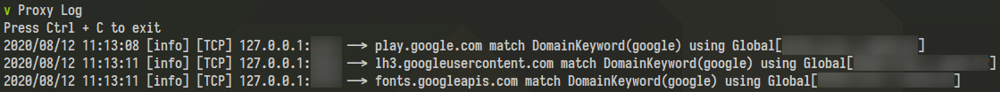

# clash-cli

A CLI tool for clash

# What can it do

- Change proxy mode
- Switch proxy node
- Realtime Traffic
- Proxy log

# How does it do this

This tool uses bbolt to store the connection data with Clash, then it send GET/PUT requests to RESTful API of Clash to control it

